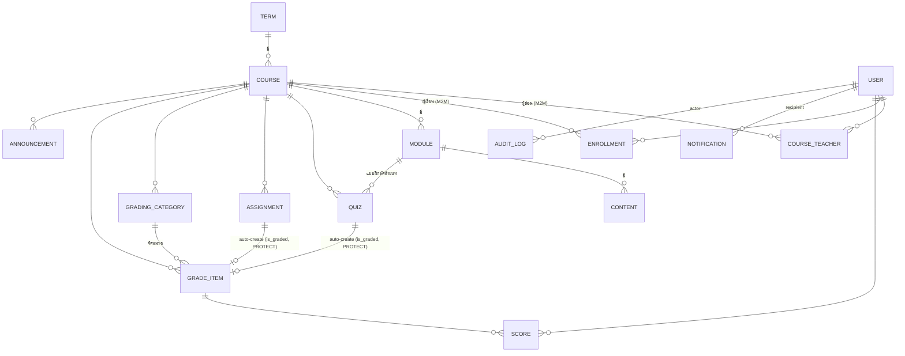
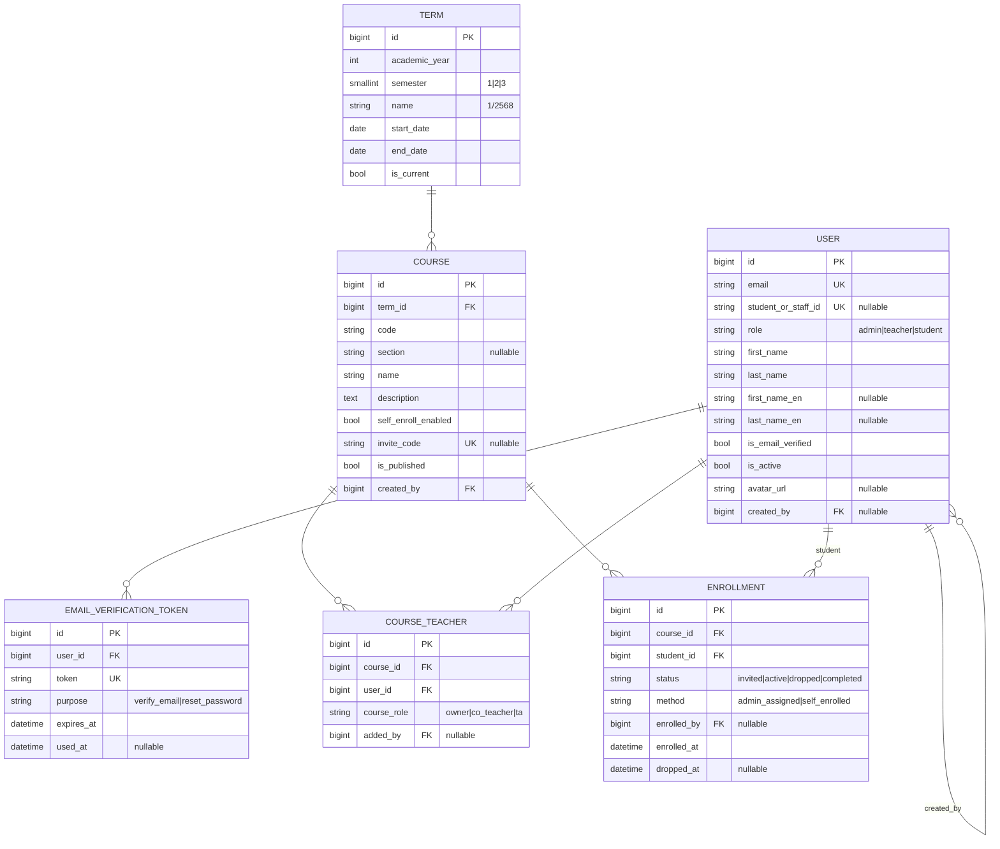
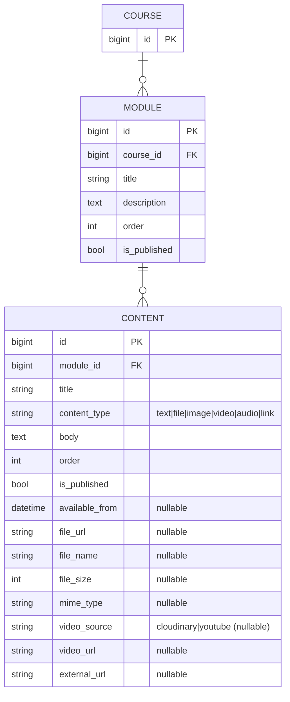
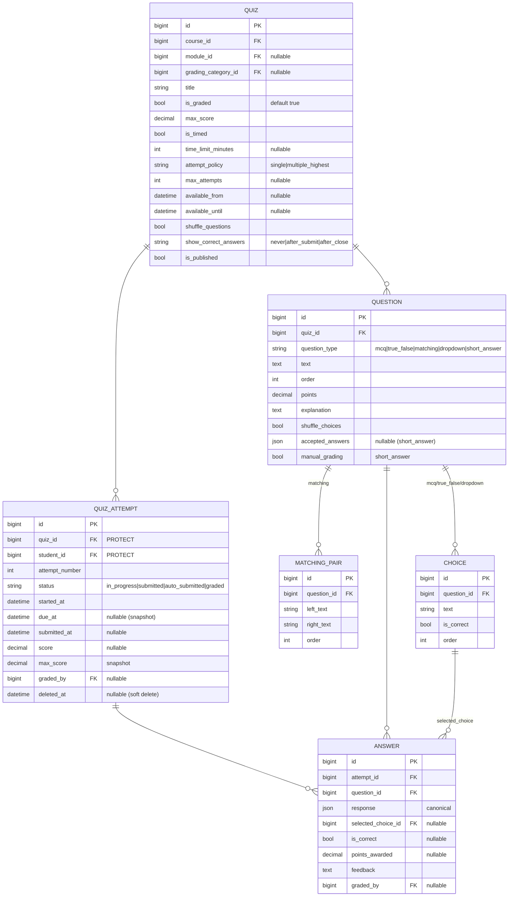
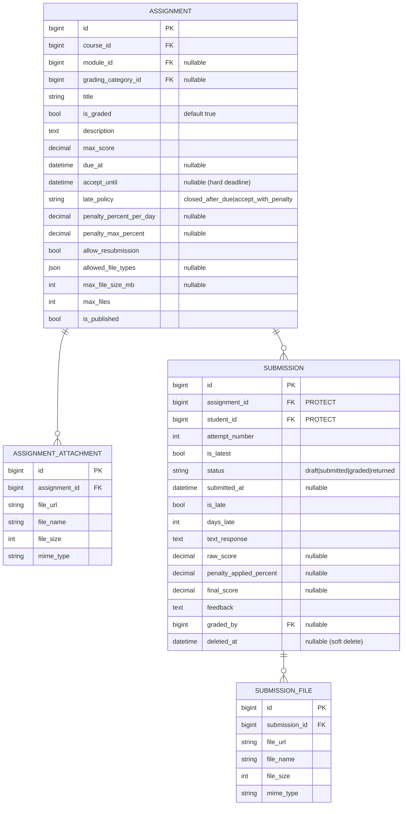
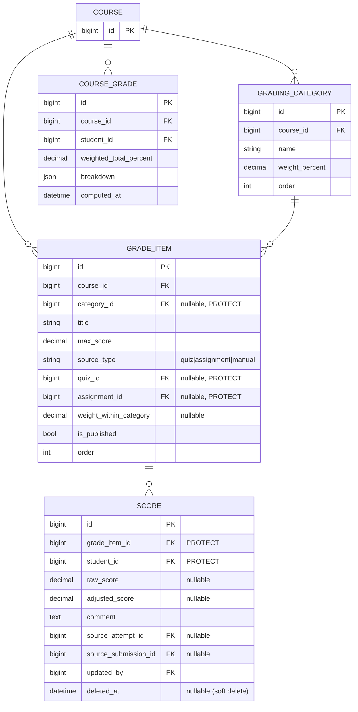
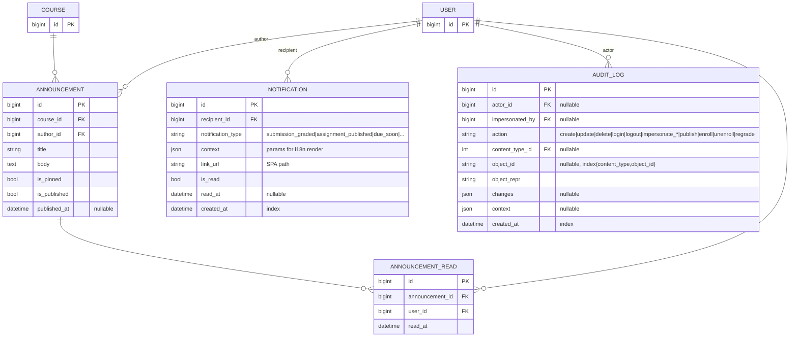

# ERD — LMS (Mermaid) · v1.3

> ประกอบกับ [`database.md`](./database.md) — แยก diagram ตามโดเมนเพื่อให้อ่านง่าย
> GitHub render Mermaid ในไฟล์ `.md` ได้โดยตรง

## ภาพรวมความสัมพันธ์หลัก

> ชื่อ/หัวข้อทุกตารางเป็น **field เดียว** (ไม่แยก `_th` / `_en`) — i18n = UI chrome เท่านั้น
> `SUBMISSION` / `QUIZ_ATTEMPT` / `SCORE` = soft delete (`deleted_at`, `deleted_by`) + unique constraint แบบ `WHERE deleted_at IS NULL`
> hard-delete จริงได้เฉพาะ draft ที่ไม่เคย publish + ไม่มีข้อมูลนักศึกษา
> **v1.3**: FK เข้าสู่ระบบคะแนนใช้ `PROTECT` ทั้งหมด — `*.student`, `Score.grade_item`, `GradeItem.category/quiz/assignment`, `QuizAttempt.quiz`, `Submission.assignment` ; **User ที่มีประวัติ = ปิด `is_active` ไม่ลบจริง**

## 1. Accounts / Academics / Enrollment

## 2. Content

## 3. Assessments (Quiz)

## 4. Assignments

## 5. Grading

## 6. Announcements / Notifications / Audit

> `NOTIFICATION` = web ล้วนใน MVP (ไม่มี email/push) — ระบบสร้าง 1 แถว/ผู้รับ trigger จาก event
